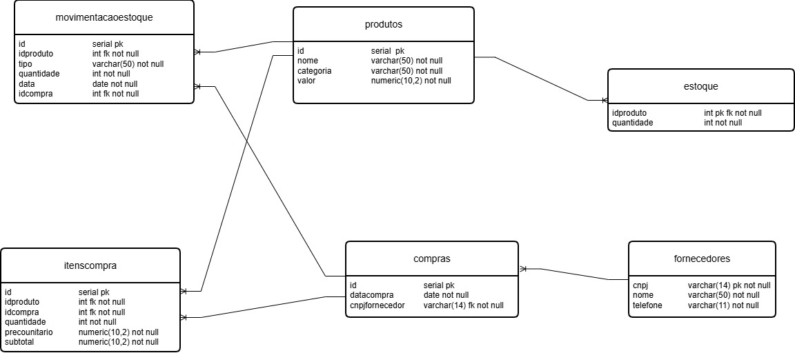

# Projeto final da Disciplina de Banco de Dados II

<h3>Draw.io</h3>

Utilizamos a ferramenta Draw.io para criar o modelo lógico.

    

# Construção do projeto

Construímos um programa em Python que permite a comunicação com o Banco de Dados PostgreSQL

